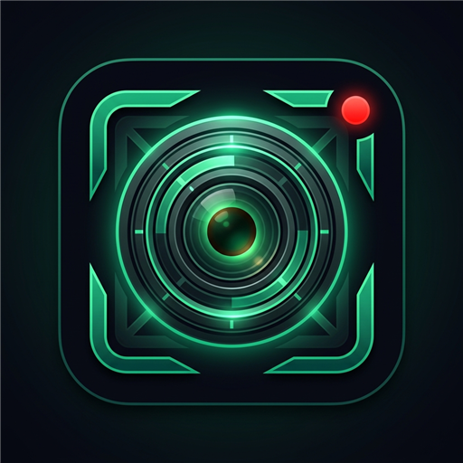

<div align="center">
  
  <h1>Vexona Screen Recorder</h1>
  <p><strong>Professional screen capture & recording app for Windows</strong></p>
</div>

---

## 📸 Features

- **High-Quality Recording:** Capture your screen, specific windows, or custom regions with ease.
- **Webcam Overlay:** Add your face to the recording with a customizable, glassmorphic webcam bubble.
- **Audio Routing:** Capture system audio and microphone inputs simultaneously, perfectly synced.
- **Privacy First:** UI sounds and clicks are synthesized in a separate audio context, preventing them from leaking into your final recording.
- **Floating Controls:** A discreet floating bar allows you to pause or stop recordings even when the main app is minimized.
- **Premium UI:** A stunning dark mode interface with modern glassmorphism design.

## 🚀 Getting Started

To run the application locally:

```bash
# Install dependencies
npm install

# Start the application
npm start
```

## 🛠 Tech Stack

- **Electron** (Main framework)
- **Vanilla JS, HTML, CSS** (UI & Logic)
- **Web Audio API** (Isolated UI sound engine)
- **MediaRecorder API** (Capture pipeline)

---

<div align="center">
  <em>Built with ❤️ by Vexona Studios</em>
</div>
